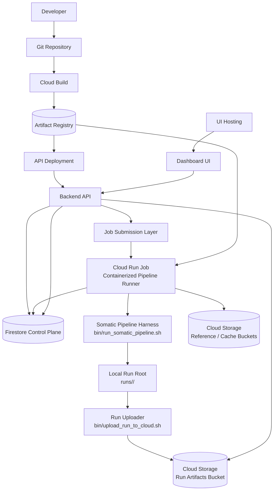
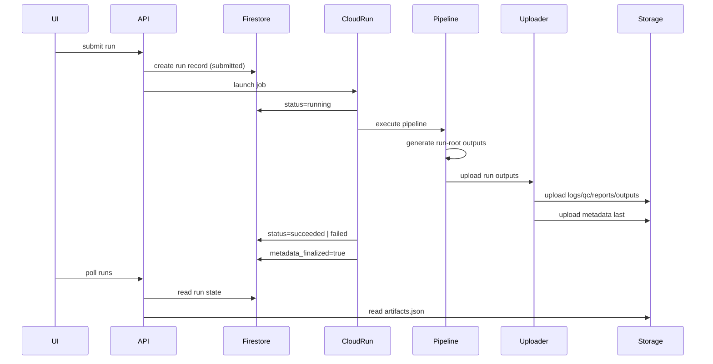

# Platform Overview — Somatic Pipeline Cloud Platform

## Purpose

This document provides a **high-level architectural overview** of the Somatic Pipeline Cloud Platform.

The platform enables deterministic somatic variant analysis pipelines to be executed in the cloud with:

* reproducible execution
* cloud-native orchestration
* durable execution records
* an interactive dashboard for monitoring and analysis

The architecture separates responsibilities across several planes:

* **Application Plane** — user-facing API and dashboard
* **Control Plane** — operational run lifecycle state
* **Execution Plane** — pipeline runtime and job execution
* **Storage Plane** — durable run metadata and artifacts
* **Build & Release Plane** — container builds and deployment automation

This architecture supports both **cloud-native orchestration** and **deterministic pipeline reproducibility**.

---

# System Architecture



---

# Architectural Planes

## 1. Build & Release Plane

Responsible for building and publishing container images used by the platform.

Components:

* **Git Repository**
* **Cloud Build**
* **Artifact Registry**

Workflow:

1. Developers push code to the repository.
2. Cloud Build is triggered.
3. Images are built and pushed to Artifact Registry.
4. Images are used for API deployment and pipeline runner jobs.

Typical container images:

* API service
* pipeline runner
* auxiliary tooling images

---

## 2. Application Plane

Provides the user interface and API used to interact with the platform.

Components:

* **Dashboard UI**
* **Backend API**
* **UI Hosting**

Responsibilities:

* run submission
* run listing and filtering
* run status monitoring
* artifact retrieval
* linking to reports and QC outputs

The UI communicates only with the API.

The API mediates access to the control plane and storage plane.

---

## 3. Control Plane

The control plane manages **live operational state** for pipeline runs.

Primary component:

* **Firestore**

Firestore stores:

* run status
* lifecycle timestamps
* orchestration state
* pointers to key artifacts
* dashboard query indexes

Example run fields:

```
run_id
sample_id
status
current_step
submitted_at
started_at
finished_at
report_html_path
stdout_log_path
stderr_log_path
error_code
error_message
metadata_finalized
```

The control plane enables:

* fast dashboard polling
* run listing and filtering
* orchestration state management

---

## 4. Execution Plane

The execution plane runs the deterministic somatic pipeline.

Components:

* **Job Submission Layer**
* **Cloud Run Job**
* **Pipeline Harness**
* **Run Uploader**

Execution workflow:

1. API receives a run submission.
2. A run record is created in Firestore.
3. The submission layer launches a Cloud Run Job.
4. The job executes the pipeline container.

The container runs:

```
bin/run_somatic_pipeline.sh
```

Outputs are written to a run-root directory:

```
runs/<run_id>/
```

or

```
out/runs/<run_id>/
```

After pipeline completion the uploader publishes the run to cloud storage.

---

## 5. Storage Plane

The storage plane provides **durable execution records**.

Primary component:

* **Cloud Storage**

Two logical storage areas exist:

### Run Artifacts Bucket

```
gs://<bucket>/runs/<run_id>/
```

Contains:

```
metadata/
logs/
qc/
reports/
outputs/
```

Metadata files:

```
run_manifest.json
status.json
artifacts.json
```

These files represent the **durable execution record**.

Artifact discovery must use:

```
metadata/artifacts.json
```

Bucket scanning must not be used for artifact discovery.

---

### Reference and Cache Buckets

Used by the pipeline for:

* reference genomes
* annotation resources
* cacheable datasets

Example:

```
gs://refs/
gs://annotation-cache/
```

These inputs are read by the Cloud Run pipeline job.

---

# Execution Lifecycle



---

# Authority Model

The system follows **ADR-0002: Hybrid Control Plane + Durable Metadata Plane**.

Authority rules:

| System                 | Responsibility                         |
| ---------------------- | -------------------------------------- |
| Firestore              | live operational state                 |
| Cloud Storage metadata | final execution record                 |
| artifacts.json         | artifact discovery                     |
| API                    | read orchestration + artifact metadata |

A run is considered **finalized** only after:

```
metadata/run_manifest.json
metadata/status.json
metadata/artifacts.json
```

are successfully uploaded to cloud storage.

---

# Repository Structure

The platform repository is organized into logical components:

```
pipeline/       pipeline logic
api/            backend service
ui/             production frontend
ui_prototype/   prototype UI
infra/          deployment and infrastructure configuration
docs/           ADRs and architecture documentation
bin/            operational scripts
docker/         container definitions
env/            environment configuration
```

---

# Design Goals

The platform architecture prioritizes:

* deterministic execution
* reproducibility
* clear artifact contracts
* separation of orchestration from execution
* scalable cloud-native infrastructure

This design allows:

* reliable pipeline execution
* auditable run records
* flexible UI and API layers
* horizontal scaling of compute jobs

---

# Summary

The Somatic Pipeline Cloud Platform integrates:

* containerized pipeline execution
* cloud-native orchestration
* durable metadata storage
* interactive dashboard monitoring

By separating **control plane state** from **durable execution metadata**, the system maintains both operational responsiveness and strong reproducibility guarantees.
