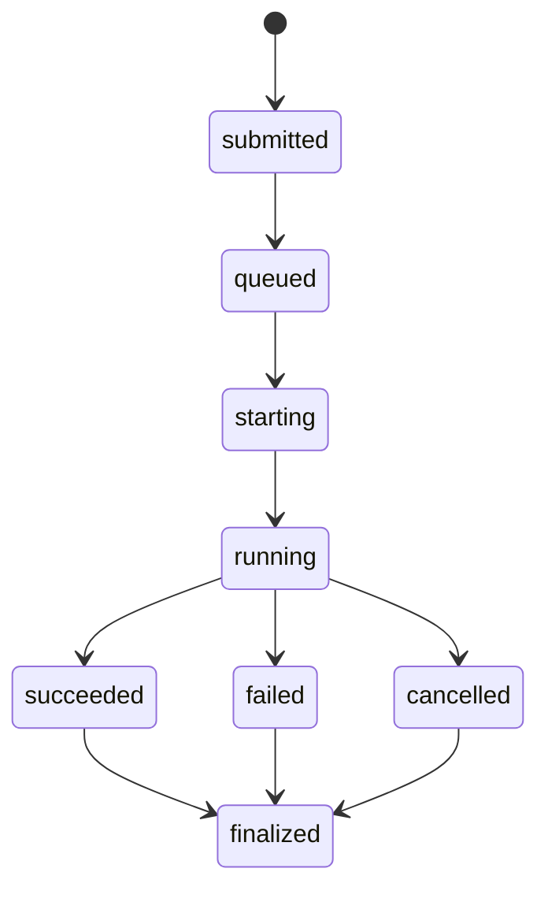
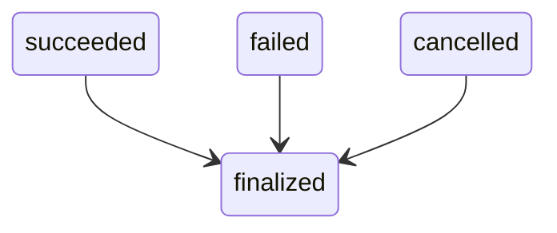
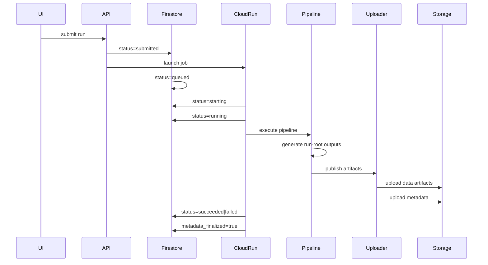

# Run Lifecycle — Somatic Pipeline Cloud Platform

## Purpose

This document defines the **lifecycle model for pipeline runs** in the Somatic Pipeline Cloud Platform.

A run lifecycle describes:

* how runs are created
* how their state evolves during execution
* how the execution record becomes finalized
* how the control plane and storage plane remain consistent

This lifecycle is the foundation for:

```
Module 5 — Run Finalization Contract
```

It ensures that:

* run orchestration remains reliable
* dashboard state is consistent
* execution records are deterministic and durable

---

# Lifecycle Overview

Each pipeline run transitions through a **finite set of states** managed by the control plane.

The lifecycle is represented as a **state machine**.



---

# Lifecycle Stages

## submitted

A run enters the system when a user submits a job through the API.

At this stage:

* the API creates a Firestore run record
* run parameters are stored
* execution has not yet begun

Firestore fields written:

```
status = submitted
submitted_at = timestamp
```

---

## queued

The run has been accepted but has not yet started execution.

This state may represent:

* scheduler backlog
* waiting for Cloud Run capacity
* job preparation

Firestore update:

```
status = queued
```

---

## starting

The execution job has been created and the pipeline container is starting.

This state typically occurs when:

* Cloud Run Job instance begins initialization
* environment preparation occurs

Firestore update:

```
status = starting
started_at = timestamp
```

---

## running

The pipeline harness is actively executing.

During this stage:

* the container runs the deterministic pipeline
* pipeline steps execute sequentially
* intermediate artifacts are written to the run root

Typical runtime location:

```
runs/<run_id>/
```

or

```
out/runs/<run_id>/
```

Firestore update:

```
status = running
current_step = pipeline stage
```

---

# Terminal States

Once pipeline execution ends, the run transitions into one of three terminal states.

## succeeded

The pipeline completed successfully.

Conditions:

* all required pipeline stages completed
* artifacts generated successfully
* uploader completed publishing artifacts

Firestore update:

```
status = succeeded
finished_at = timestamp
exit_code = 0
```

---

## failed

The pipeline terminated due to an error.

Possible failure categories:

```
pipeline_error
infrastructure_error
resource_error
timeout
unexpected_exception
```

Firestore update:

```
status = failed
finished_at = timestamp
exit_code = nonzero
failure_category
failure_message
```

---

## cancelled

Execution was intentionally stopped.

Examples:

* user cancellation
* administrative interruption
* platform-level shutdown

Firestore update:

```
status = cancelled
finished_at = timestamp
```

---

# Finalization Phase

Terminal states do **not immediately finalize the run**.

Before a run is considered complete, the system must ensure that the **durable execution record is written**.

The finalization phase guarantees that:

* metadata files exist in cloud storage
* artifact inventory is complete
* execution provenance is preserved

---

# Durable Metadata Plane

Each run produces canonical metadata files under:

```
gs://<bucket>/runs/<run_id>/metadata/
```

Required files:

```
run_manifest.json
status.json
artifacts.json
```

These files represent the **durable execution record**.

Responsibilities:

| File              | Purpose                   |
| ----------------- | ------------------------- |
| run_manifest.json | run parameters and inputs |
| status.json       | final lifecycle state     |
| artifacts.json    | artifact inventory        |

Artifact discovery must rely on:

```
metadata/artifacts.json
```

Bucket scanning must **not** be used.

---

# Metadata Finalization

A run becomes finalized only after:

```
run_manifest.json uploaded
status.json uploaded
artifacts.json uploaded
```

When this condition is met, the execution record is durable.

The system then marks the run as finalized in the control plane.

Firestore update:

```
metadata_finalized = true
```

---

# Finalized State

After finalization the run enters the implicit state:

```
finalized
```

Characteristics:

* execution record is immutable
* artifacts are fully discoverable
* dashboard views become stable
* reproducibility is guaranteed

Final state model:



---

# Lifecycle Timeline

The typical execution timeline is:



---

# Control Plane vs Durable Metadata Plane

The lifecycle reflects the system's hybrid architecture.

| Plane         | Responsibility           |
| ------------- | ------------------------ |
| Firestore     | operational run state    |
| Cloud Storage | durable execution record |

Authority model:

```
Firestore = live orchestration state
Cloud Storage metadata = canonical run record
```

This separation supports:

* fast dashboard polling
* deterministic run provenance
* reproducible artifact discovery

---

# Failure Recovery

Because the execution record is stored in cloud storage:

* run artifacts remain available even if Firestore state is lost
* execution history can be reconstructed from metadata files
* debugging is simplified

This is a core goal of the platform's architecture.

---

# Summary

The run lifecycle defines a deterministic state machine governing pipeline execution.

Runs progress through the states:

```
submitted
queued
starting
running
succeeded | failed | cancelled
finalized
```

Finalization occurs only after the durable metadata plane is complete.

This model ensures:

* reliable orchestration
* reproducible execution records
* clean separation between operational state and execution provenance

The lifecycle defined here forms the foundation for:

```
Module 5 — Run Finalization Contract
```
