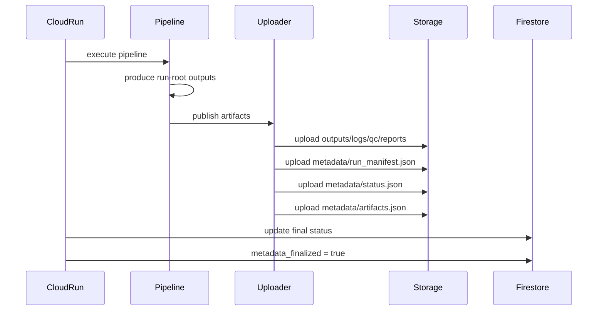

# Run Finalization Contract — Somatic Pipeline Cloud Platform

## Purpose

This document defines the **Run Finalization Contract** for the Somatic Pipeline Cloud Platform.

The contract governs how a pipeline run transitions from:

```
execution in progress
```

to

```
durable finalized execution record
```

It specifies:

* ordering guarantees between pipeline execution and metadata publication
* responsibilities of the pipeline runner and uploader
* synchronization rules between Firestore and Cloud Storage
* conditions under which a run is considered **finalized**

This contract enforces the architecture described in:

```
ADR-0002: Hybrid Control Plane + Durable Metadata Plane
```

---

# Architectural Context

The platform uses two separate but coordinated planes:

| Plane                  | System        | Responsibility             |
| ---------------------- | ------------- | -------------------------- |
| Control Plane          | Firestore     | live orchestration state   |
| Durable Metadata Plane | Cloud Storage | canonical execution record |

Firestore is optimized for:

* dashboard polling
* run listing
* orchestration state

Cloud Storage is authoritative for:

* execution provenance
* artifact inventory
* debugging and reproducibility

Finalization ensures that these two planes remain consistent.

---

# Run Finalization Definition

A run is considered **finalized** only after:

1. The pipeline execution has completed.
2. All required artifacts have been uploaded to cloud storage.
3. The canonical metadata files exist in storage.

Required metadata files:

```
metadata/run_manifest.json
metadata/status.json
metadata/artifacts.json
```

After these files exist, the control plane must record:

```
metadata_finalized = true
```

---

# Finalization Ordering Rules

Finalization requires **strict ordering guarantees**.

The system must enforce the following sequence:

```
1. pipeline execution completes
2. uploader publishes all artifacts
3. uploader publishes metadata files
4. control plane updated with final state
```

This ordering prevents the control plane from advertising a run as complete before its execution record exists.

---

# Finalization Flow



---

# Metadata Publication Rules

Metadata files must be uploaded **after data artifacts**.

Required ordering:

```
outputs/
logs/
qc/
reports/
metadata/
```

Within metadata:

```
run_manifest.json
status.json
artifacts.json
```

This ensures that:

```
artifacts.json references only objects that already exist
```

---

# Control Plane Update Rules

Firestore updates must follow strict sequencing.

## During execution

Typical updates:

```
status = starting
status = running
current_step = pipeline stage
```

## At completion

After metadata publication:

```
status = succeeded | failed | cancelled
finished_at = timestamp
metadata_finalized = true
```

The control plane **must not set** `metadata_finalized=true` until metadata files exist in storage.

---

# Artifact Discovery Rules

Artifact discovery must always use:

```
metadata/artifacts.json
```

The API must **not scan bucket prefixes** to discover files.

Reasons:

* deterministic artifact listing
* stable API responses
* faster dashboard queries
* reproducible execution records

---

# Failure Scenarios

The contract must protect against inconsistent states.

## Scenario: pipeline failure before uploader

Firestore state:

```
status = failed
metadata_finalized = false
```

No durable metadata record exists.

---

## Scenario: uploader failure

Possible state:

```
status = running
metadata_finalized = false
```

Resolution:

* job retry
* manual recovery
* re-run uploader

---

## Scenario: metadata uploaded but Firestore not updated

Storage contains full run record.

Firestore shows:

```
status = running
metadata_finalized = false
```

Recovery is possible because:

```
Cloud Storage remains authoritative
```

The control plane can be reconstructed.

---

# Finalized Run Characteristics

A finalized run guarantees:

```
metadata files exist
artifact inventory is complete
artifact paths are stable
execution provenance is preserved
```

Consumers such as the dashboard may safely assume:

```
the run record is immutable
```

---

# Authority Model

Finalization enforces the platform authority rules.

| System                 | Authority              |
| ---------------------- | ---------------------- |
| Firestore              | live operational state |
| Cloud Storage metadata | final execution record |

Once finalized:

```
Cloud Storage metadata becomes canonical.
```

Firestore serves only as an operational index.

---

# Responsibilities

## Cloud Run Job

Responsible for:

* executing the pipeline
* invoking the uploader
* updating Firestore state

---

## Pipeline Harness

Responsible for:

* deterministic execution
* writing run-root artifacts
* generating metadata files

---

## Run Uploader

Responsible for:

* publishing artifacts to storage
* preserving upload ordering
* ensuring metadata completeness

---

# Finalization Invariant

The platform must always maintain the invariant:

```
metadata_finalized = true
    implies
metadata/run_manifest.json exists
metadata/status.json exists
metadata/artifacts.json exists
```

Violation of this invariant represents a system error.

---

# Summary

The Run Finalization Contract guarantees that:

* pipeline runs produce a durable execution record
* the control plane and storage plane remain consistent
* artifact discovery is deterministic
* debugging and reproducibility remain reliable

A run becomes finalized only when the **durable metadata plane is complete and recorded in the control plane**.

This contract enables the Somatic Pipeline Cloud Platform to combine:

```
cloud-native orchestration
+
deterministic scientific reproducibility
```
